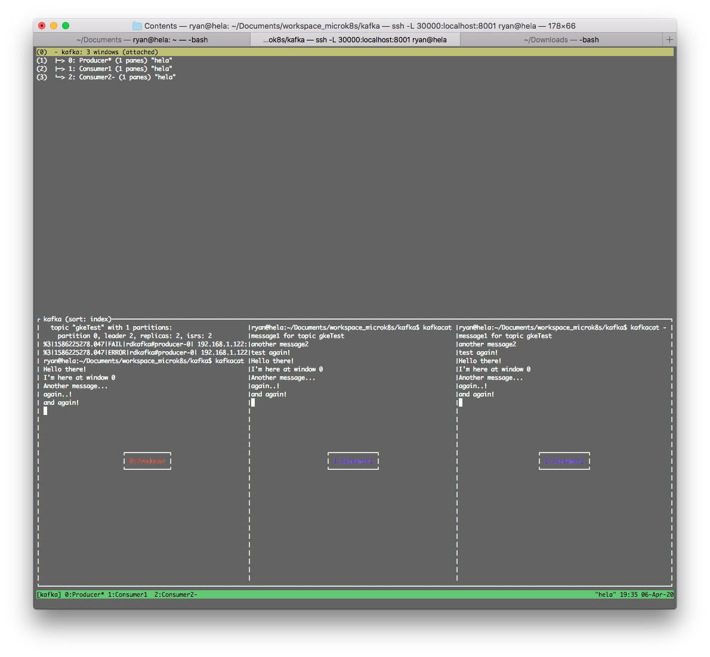

# kafka
[https://github.com/helm/charts/tree/master/incubator/kafka]( https://github.com/helm/charts/tree/master/incubator/kafka)

## 1. install with helm charts
``` bash
$ helm repo add incubator http://storage.googleapis.com/kubernetes-charts-incubator
$ kubectl create ns kafka

$ wget https://raw.githubusercontent.com/helm/charts/master/incubator/kafka/values.yaml
$ vi values.yaml 

$ microk8s.helm install --name my-kafka --namespace kafka -f values.yaml incubator/kafka
NAME:   my-kafka
LAST DEPLOYED: Mon Apr  6 18:47:08 2020
NAMESPACE: kafka
STATUS: DEPLOYED

RESOURCES:
==> v1/ConfigMap
NAME                AGE
my-kafka-zookeeper  1s

==> v1/Pod(related)
NAME                  AGE
my-kafka-0            0s
my-kafka-zookeeper-0  0s

==> v1/Service
NAME                         AGE
my-kafka                     1s
my-kafka-0-external          1s
my-kafka-1-external          1s
my-kafka-2-external          1s
my-kafka-headless            1s
my-kafka-zookeeper           1s
my-kafka-zookeeper-headless  1s

==> v1/StatefulSet
NAME                AGE
my-kafka            1s
my-kafka-zookeeper  1s

==> v1beta1/PodDisruptionBudget
NAME                AGE
my-kafka-zookeeper  1s


NOTES:
### Connecting to Kafka from inside Kubernetes

You can connect to Kafka by running a simple pod in the K8s cluster like this with a configuration like this:

  apiVersion: v1
  kind: Pod
  metadata:
    name: testclient
    namespace: kafka
  spec:
    containers:
    - name: kafka
      image: confluentinc/cp-kafka:5.0.1
      command:
        - sh
        - -c
        - "exec tail -f /dev/null"

Once you have the testclient pod above running, you can list all kafka
topics with:

  kubectl -n kafka exec testclient -- kafka-topics --zookeeper my-kafka-zookeeper:2181 --list

To create a new topic:

  kubectl -n kafka exec testclient -- kafka-topics --zookeeper my-kafka-zookeeper:2181 --topic test1 --create --partitions 1 --replication-factor 1

To listen for messages on a topic:

  kubectl -n kafka exec -ti testclient -- kafka-console-consumer --bootstrap-server my-kafka:9092 --topic test1 --from-beginning

To stop the listener session above press: Ctrl+C

To start an interactive message producer session:
  kubectl -n kafka exec -ti testclient -- kafka-console-producer --broker-list my-kafka-headless:9092 --topic test1

To create a message in the above session, simply type the message and press "enter"
To end the producer session try: Ctrl+C

If you specify "zookeeper.connect" in configurationOverrides, please replace "my-kafka-zookeeper:2181" with the value of "zookeeper.connect", or you will get error.


### Connecting to Kafka from outside Kubernetes

You have enabled the external access feature of this chart.

**WARNING:** By default this feature allows Kafka clients outside Kubernetes to
connect to Kafka via NodePort(s) in `PLAINTEXT`.

Please see this chart's README.md for more details and guidance.

If you wish to connect to Kafka from outside please configure your external Kafka
clients to point at the following brokers. Please allow a few minutes for all
associated resources to become healthy.
  
  my-kafka.cluster.local:31090
  my-kafka.cluster.local:31091
  my-kafka.cluster.local:31092


$ kubectl get all -n kafka
NAME                       READY   STATUS    RESTARTS   AGE
pod/my-kafka-0             1/1     Running   2          12m
pod/my-kafka-1             1/1     Running   0          10m
pod/my-kafka-2             1/1     Running   0          9m59s
pod/my-kafka-zookeeper-0   1/1     Running   0          12m
pod/my-kafka-zookeeper-1   1/1     Running   0          12m
pod/my-kafka-zookeeper-2   1/1     Running   0          11m
pod/testclient             1/1     Running   2          3h44m

NAME                                  TYPE           CLUSTER-IP       EXTERNAL-IP     PORT(S)                      AGE
service/my-kafka                      ClusterIP      10.152.183.140   <none>          9092/TCP                     12m
service/my-kafka-0-external           LoadBalancer   10.152.183.182   192.168.1.120   31090:30652/TCP              12m
service/my-kafka-1-external           LoadBalancer   10.152.183.130   192.168.1.121   31090:30482/TCP              12m
service/my-kafka-2-external           LoadBalancer   10.152.183.25    192.168.1.122   31090:31678/TCP              12m
service/my-kafka-headless             ClusterIP      None             <none>          9092/TCP                     12m
service/my-kafka-zookeeper            ClusterIP      10.152.183.102   <none>          2181/TCP                     12m
service/my-kafka-zookeeper-headless   ClusterIP      None             <none>          2181/TCP,3888/TCP,2888/TCP   12m

NAME                                  READY   AGE
statefulset.apps/my-kafka             3/3     12m
statefulset.apps/my-kafka-zookeeper   3/3     12m
```


### Test it with `kafkacat`:
```bash
$ kafkacat -b 192.168.1.120:31090 -L
Metadata for all topics (from broker 0: 192.168.1.120:31090/0):
 3 brokers:
  broker 2 at 192.168.1.122:31090
  broker 1 at 192.168.1.121:31090
  broker 0 at 192.168.1.120:31090 (controller)
 0 topics:

$ kafkacat -b 192.168.1.120:31090 -P -t gkeTest -p 0
message1 for topic gkeTest

another message2
test again!

$ kafkacat -b 192.168.1.120:31090 -C -t gkeTest -p 0
message1 for topic gkeTest
% Reached end of topic gkeTest [0] at offset 1
another message2
% Reached end of topic gkeTest [0] at offset 2
test again!
% Reached end of topic gkeTest [0] at offset 3
```


## 2. Add IPs for Load Balancer:
```bash
Add more IPs for Load Balancer:
$ ip addr
2: eno1: <BROADCAST,MULTICAST,UP,LOWER_UP> mtu 1500 qdisc pfifo_fast state UP group default qlen 1000
    link/ether e0:3f:49:af:89:80 brd ff:ff:ff:ff:ff:ff
    inet 192.168.1.101/24 brd 192.168.1.255 scope global dynamic eno1

$ sudo ip addr add 192.168.1.120/24 broadcast 192.168.1.255 dev eno1 label eno1:1
$ sudo ip addr add 192.168.1.121/24 broadcast 192.168.1.255 dev eno1 label eno1:2
$ sudo ip addr add 192.168.1.122/24 broadcast 192.168.1.255 dev eno1 label eno1:3
$ sudo ip addr add 192.168.1.123/24 broadcast 192.168.1.255 dev eno1 label eno1:4
$ sudo ip addr add 192.168.1.124/24 broadcast 192.168.1.255 dev eno1 label eno1:5

$ ip addr
2: eno1: <BROADCAST,MULTICAST,UP,LOWER_UP> mtu 1500 qdisc pfifo_fast state UP group default qlen 1000
    link/ether e0:3f:49:af:89:80 brd ff:ff:ff:ff:ff:ff
    inet 192.168.1.101/24 brd 192.168.1.255 scope global dynamic eno1
       valid_lft 66892sec preferred_lft 66892sec
    inet 192.168.1.120/24 brd 192.168.1.255 scope global secondary eno1:1
       valid_lft forever preferred_lft forever
    inet 192.168.1.121/24 brd 192.168.1.255 scope global secondary eno1:2
       valid_lft forever preferred_lft forever
    inet 192.168.1.122/24 brd 192.168.1.255 scope global secondary eno1:3
       valid_lft forever preferred_lft forever
    inet 192.168.1.123/24 brd 192.168.1.255 scope global secondary eno1:4
       valid_lft forever preferred_lft forever
    inet 192.168.1.124/24 brd 192.168.1.255 scope global secondary eno1:5
       valid_lft forever preferred_lft forever

$ sudo bash
# microk8s.enable metallb
Enabling MetalLB
Enter the IP address range (e.g., 10.64.140.43-10.64.140.49): 192.168.1.120-192.168.1.124
```

## 3. Add test client:
```bash
$ microk8s.kubectl -n kafka create -f testclient.yaml
```
